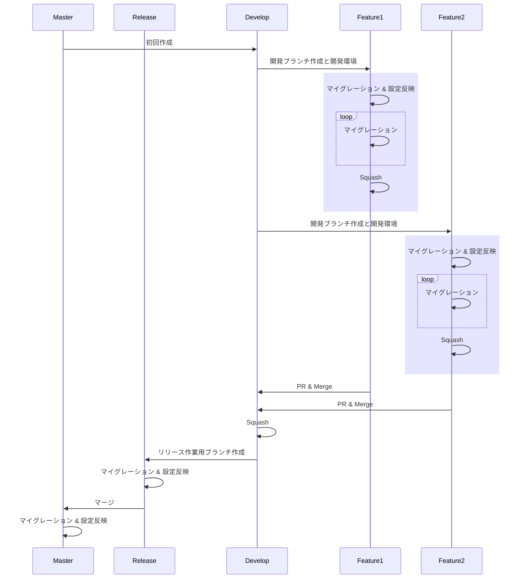

## 開発


### 環境変数
```shell
cp .env.sample .env.development
cp .env.sample .env.production
```

###  インストール Hasura CLI
https://hasura.io/docs/latest/graphql/core/hasura-cli/install-hasura-cli.html#install-hasura-cli

### コンソール起動
ローカルで開発する場合は、以下のコマンドでコンソールを起動して開発してください。
GUI上で変更した内容がmetadataやmigrationsに反映されます。

```shell
hasura console --envfile .env.development
```

### マイグレーション & 設定反映
これまでに開発した内容指定した環境に適用するには以下のコマンドを実行してください。

```shell
# develop → feature
# 新しい機能を作成するとき
hasura migrate apply --envfile .env.development
hasura metadata apply --envfile .env.development

# develop → release または release → master
# 開発した内容をリリースするとき
hasura migrate apply --envfile .env.production
hasura metadata apply --envfile .env.production
```

### Squash
開発中に何回かに分けてテーブルを作ったりするとマイグレーションファイルがその分だけ生成されます。不必要にマイグレーションファイルが別れている場合は見通しが悪くなるので以下のコマンドで1にまとめて下さい。


```shell
hasura squash --from <version> --envfile .env.development

# versionの確認
hasura squash --envfile .env.development
> VERSION        NAME                          SOURCE STATUS  DATABASE STATUS
> 1635575430317  init                          Present        Present
> 1635584476802  create_table_public_hogehoge  Present        Present
> 1635584768981  drop_table_public_hogehoge    Present        Present
```



